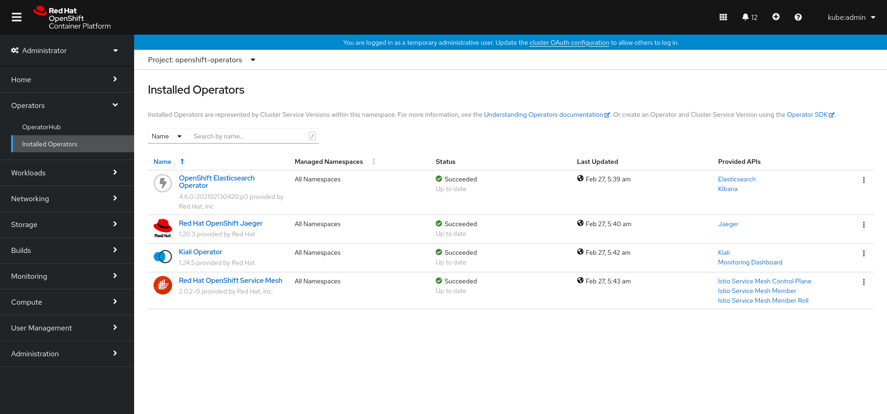
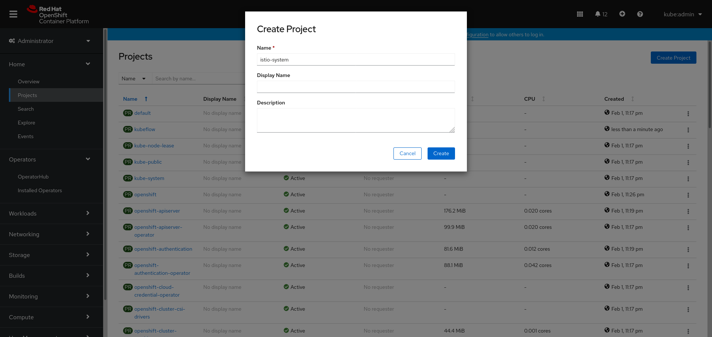
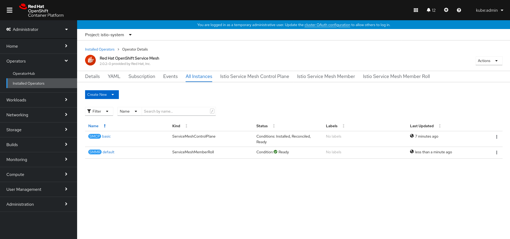
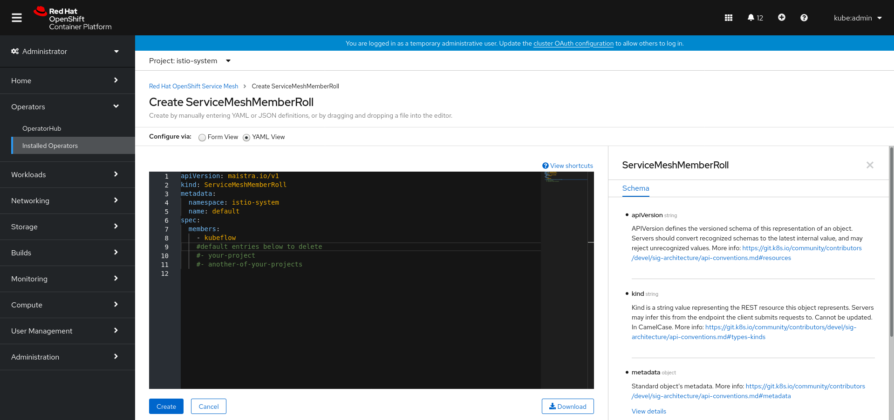
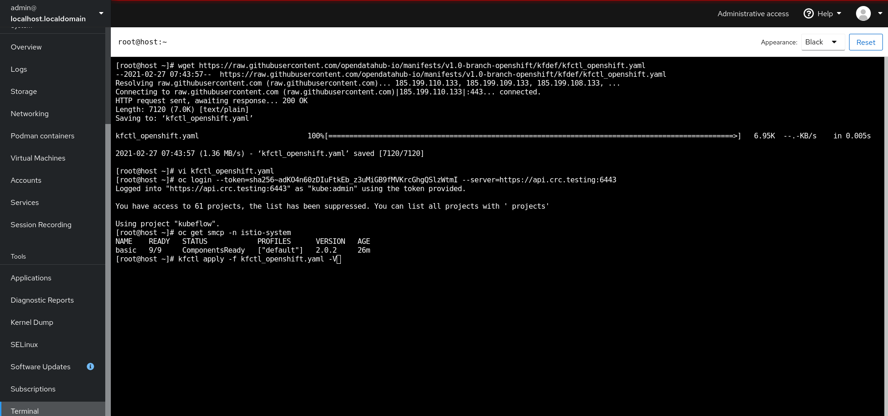
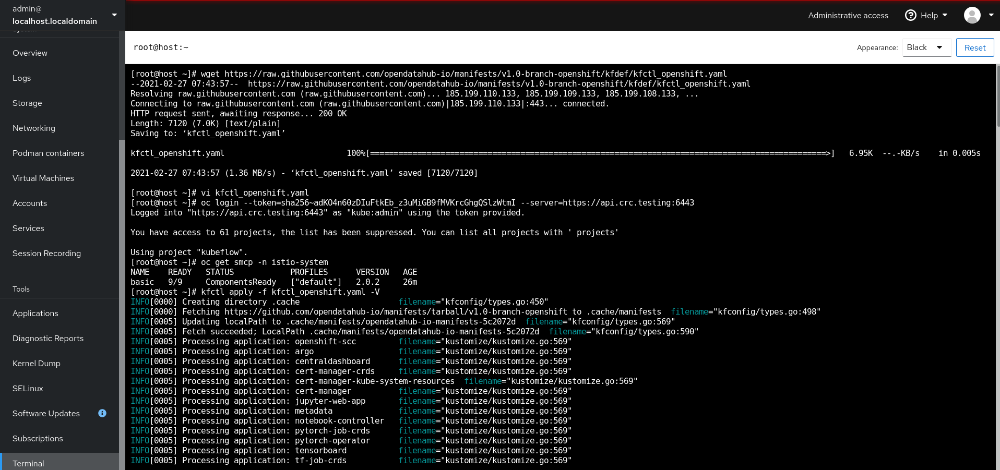
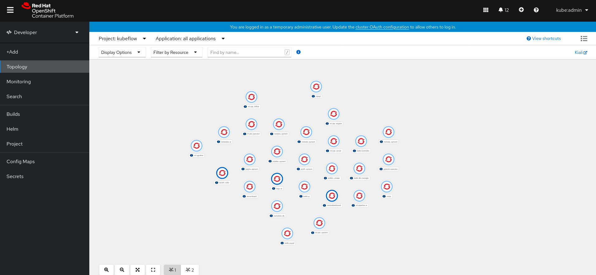

# How to install Kubeflow v1 on OpenShift v4.6 with Service Mesh v2

If you're looking to run a robust machine learning toolkit on an enterprise-class Kubernetes distribution with a microservice network, you came to the right article. This post builds upon the deployment path of earlier software versions [Integrating Kubeflow with Red Hat OpenShift Service Mesh](https://developers.redhat.com/blog/2020/04/24/integrating-kubeflow-with-red-hat-openshift-service-mesh/) with some tweaks along the way for current versions. This process utilizes both the web console and the command line to perform the installation:
1. From the web console: installing operators, creating projects, configuring the service mesh
1. From the command line: downloading a Kubeflow github manifest, editing it and deploying it.

Before you being, you will need admin access to a Red Hat OpenShift "OCP" cluster 4.5 and above. You don't have one? Here are some options: 

# Install Operators

As an admin from your OpenShift OperatorHub, you need to install this sequence of 4 Red Hat operators: Elasticsearch, OpenShift Jaeger, Kiali and Red Hat Service Mesh.

First, **install the OpenShift Elasticsearch Operator provided by Red Hat** for configuring and managing an Elasticsearch cluster for use in tracing and cluster logging as well as a Kibana instance to connect to it. This operator only supports OCP Cluster Logging and Jaeger. It is tightly coupled to each and is not currently capable of being used as a general purpose manager of Elasticsearch clusters running on OCP, like Elastic's Elasticsearch (ECK) Operator. Accept defaults for Update Channel, Installation Mode across all namespaces, the recommended openshift-operators-redhat namespace, and Automatic Approval Strategy. Wait for the Installed Operators status to display Succeeded before continuing.

Second, **install the Red Hat OpenShift Jaeger Operator** for monitoring and troubleshooting microservices-based distributed systems. We are intending to deploy an Elasticsearch cluster via the Jaeger custom resource, so the Elasticsearch Operator must first be installed. Accept defaults for Stable Update Channel, Installation Mode across all namespaces, the recommended openshift-operators namespace, and Automatic Approval Strategy. Wait for the Installed Operators status to display Succeeded before continuing.

Third, install the **Kiali Operator provided by Red Hat** to visualize insights about the mesh components at different levels. Accept defaults for Stable Update Channel, Installation Mode across all namespaces, the recommended openshift-operators namespace, and Automatic Approval Strategy. Wait for the Installed Operators status to display Succeeded before continuing.

Last, install the **Red Hat OpenShift Service Mesh Operator**, based on the open source Istio project, adds a transparent layer on existing distributed applications without requiring any changes to the service code. Once an instance of Red Hat OpenShift Service Mesh has been installed, it will only exercise control over services within its own project. Other projects may be added into the mesh using one of two methods: A ServiceMeshMember resource and A ServiceMeshMemberRoll resource, which we will be doing the latter. Accept defaults for Stable Update Channel, Installation Mode across all namespaces, the recommended openshift-operators namespace, and Automatic Approval Strategy. Wait for the Installed Operators status to display Succeeded before continuing. 

# Create Projects

After the operators have installed successfully, create 2 projects: kubeflow and istio-system.

**Create a new project call kubeflow**, which will serve as the deployment namespace for the kubeflow resources. From the Kubeflow interface, new namespaces will be created and reflected back in OpenShift. This is different than Open Data Hub as the deployment is configured directly in the desired OpenShift project. **Create another new project call istio-system**, which will serve as the control-plane for the Kubeflow service mesh and any namespace created from it. 

# Deploy Service Mesh Control Plane

If you are interested, here is a detailed review in the [differences between upstream Istio Service Mesh and downstream Red Hat Service Mesh](https://access.redhat.com/documentation/en-us/openshift_container_platform/4.6/html-single/service_mesh/index#ossm-vs-community). Now, from the istio-system project, you will create a control plane and service mesh member roll that will provide a service mesh for the kubeflow project and other created from it.

Switch to the istio-system project and go to Installed Operators. Select the Istio Service Mesh Control Plane "SMCP" and **Create a Service Mesh Control Plane instance**. If new to this implementation, defaults are recommended. Meanwhile, Here are some configurations to investigate that were set for this deployment:
1. Name left as `basic`
2. Control Plane Version set to `v2.0`. If you want to explore v1.x, you must also change the Policy > Type of Policy to `Mixer`.
3. Security > Control Plane Security set to `True` to [enable mTLS](https://access.redhat.com/documentation/en-us/openshift_container_platform/4.6/html-single/service_mesh/index#ossm-security-mtls_ossm-security)
4. Injection > Auto Inject set to `True` to ensure [correct app default networking](https://access.redhat.com/documentation/en-us/openshift_container_platform/4.6/html-single/service_mesh/index#ossm-sidecar-injection_deploying-applications-ossm)
5. OpenShift route set to `True` so [modifications to gateways are automatically mirrored with routes](https://access.redhat.com/documentation/en-us/openshift_container_platform/4.6/html-single/service_mesh/index#ossm-auto-route_routing-traffic).
Wait for the SMCP basic status to display Conditions: Installed, Reconciled, Ready. Resource creation can take a few minutes, so monitoring the control plane resources can help identify issues early.

Once SMCP comples successfully, **create a Istio Service Mesh Member Roll** in the same location from the Red Hat Service Mesh installed operator under the istio-system project. Switch to the YAML View and replace the default members with the initial member `kubeflow`. Keep in mind, for additional projects to become members of this Control Plane or have their own, you will have to decide and manually create a new plane or update the members based on the requirements. Ansible Automation and GitOps might be a solution for automating this change. Wait for the Service Mesh Member Roll "SMMR" to display status of Ready before continuing.

# Prepare for the deployment

Ill cover two approaches based on different skillsets: 1) deploy using the ODH operator 2) deploy using the terminal.

## Option 1: Deploy using the ODH Operator

## Option 2: Deploy using the terminal

Switch to a terminal and log into the OCP cluster to deploy the Kubeflow tools. You will need to install 2 tools (oc and kfctl), download and edit a Kubeflow manifest. For this part of the session, a [RHEL 8.3 host cockpit terminal session](https://access.redhat.com/documentation/en-us/red_hat_enterprise_linux/8/html/managing_systems_using_the_rhel_8_web_console/getting-started-with-the-rhel-8-web-console_system-management-using-the-rhel-8-web-console) was used, which offers a lot of other advanced capabilities.

**Download, install and move the oc command line tool into your path.** With the OpenShift command line interface, you can create applications and manage OpenShift projects from a terminal. Detailed steps can be found here: https://docs.openshift.com/container-platform/4.6/cli_reference/openshift_cli/getting-started-cli.html. **Log into the cluster using the oc login command.**  

**Download, install and move the kfctl tool into your path.** Recommend executing the deployment as root to avoid any permission errors during.

|step|sample linux command|
|-|-|
|switch to root|`sudo -i`|
|get the kfctl tool|`wget https://github.com/kubeflow/kfctl/releases/download/v1.2.0/kfctl_v1.2.0-0-gbc038f9_linux.tar.gz`|
|unpack the tar|`tar -xf kfctl_v1.2.0-0-gbc038f9_linux.tar.gz`|
|check your path options|`echo $PATH`|
|move the tool into your path|`mv kfctl /usr/bin`|
|check the command|`kfctl version`|
|login as a cluster admin|`oc login --token=<enter-token> --server=https://api.<enter-cluster>.com:6443`|

**Download a copy of a Kubeflow KfDef manifest.** Because you will only make minor edits to the KfDef manifest prior to deployment (e.g. deleting components) and we will keep it pointed to the github repo url, you don't need to clone the entire repository. If you are unfamiliar with the raw.githubusercontent... url it is from clicking the raw button on this page https://github.com/opendatahub-io/manifests/blob/v1.0-branch-openshift/kfdef/kfctl_openshift.yaml.

|step|sample linux command|
|-|-|
|download the manifest|`wget https://raw.githubusercontent.com/opendatahub-io/manifests/v1.0-branch-openshift/kfdef/kfctl_openshift.yaml`|
|review the file|`vim kfctl_openshift_servicemesh.yaml`|
|remove components|
`istio-crds` `istio-install` `istio` `metacontroller` `kubeflow-roles` `bootstrap` `webhook` `knative` `knative-install` `kfserving-crds` `kfserving-install`
|

**Apply the Kubeflow manifest.**  This will fetch the configurations from the github repo, update it to a .cache manifest and change the LocalPath to .cache for each of the included application entries from the KfDef. If you wanted to make more comlex changes you could clone the entire manifest repo, point the KfDef uri to your now local manifest, and run a kfctl build -f kfctl_openshift.yaml prior to the apply. Since this is a simplier deployment, we can jump right to apply. You will want to keep the three artifacts (.cache/, kfctl_openshift.yaml, kustomize/) from this procedure to modify or delete the deployment in the future. Wait for the apply command to complete and log a message `Applied the configuration Successfully!`.

|step|sample linux command|
|-|-|
|deploy in kubeflow project|`oc project kubeflow`|
|apply the manifest|`kfctl apply -f kfctl_openshift_servicemesh.yaml -V`|

You can monitor the progress from the command line or web console. The Developer perspective offers a visual topology for both the projects kubeflow, where the tools pods are creating, and istio-system, where the service mesh is configured.

**Get the route to the Kubeflow Central Dashboard.** You can get the url from the CLI or from the Web UI to access the Kubeflow Dashboard. After registry process and creating a namespace, you will see a similar dashboard below.

|step|sample linux command|
|-|-|
|get the route|`oc get routes -n istio-system istio-ingressgateway -o jsonpath='http://{.spec.host}/'`|

# Uninstall Kubeflow

No good procedure is ever complete without a way to undo it, make modifications and run it again. Those 3 artifacts from earlier enable the delete command to execute.

|step|sample linux command|
|-|-|
|login as a cluster admin|`oc login --token=<enter-token> --server=https://api.<enter-cluster>.com:6443`|
|delete the deployment|`kfctl delete -f kfctl_openshift_servicemesh.yaml -V`|
|delete mutating webhooks|`oc delete mutatingwebhookconfigurations.admissionregistration.k8s.io --all`|
|delete validating webhooks|`oc delete validatingwebhookconfigurations.admissionregistration.k8s.io --all`|
|remove the generated folders|`rm -rf {kustomize,.cache}`|
