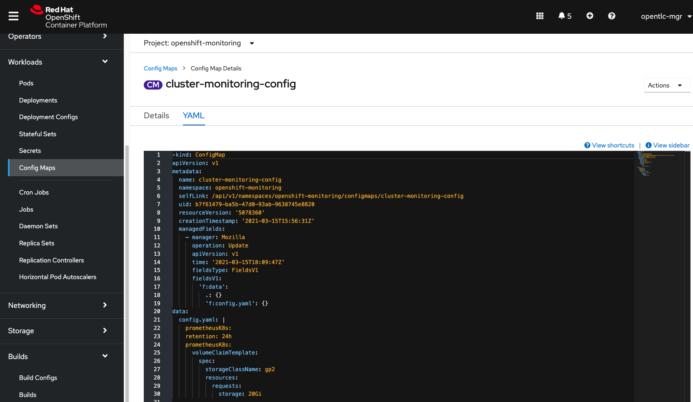
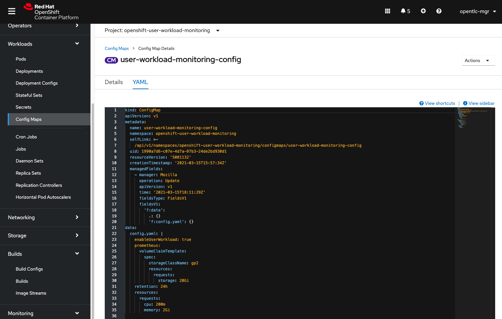

# Kubeflow Security Assessment (IN WORK)
## Background
As Open Data Hub and Kubeflow gets more attention in the AI/ML space, the security posture is a top priority to understand. Kubeflow is a designed to be a composable set of ML tools, therefore no two installations may be alike. 

## Goals
Create repeatable procedure/report to automate the security posture assessment for any variation of Kubeflow by reporting post-installation:
1. Manually query kubeflow containers/images 
1. Automate queries using Prometheus/Grafana Operators 
1. Scan for CVEs recurringly with Quay Security Operator

## Procedure
This procedure should be used to create an automated reporting/scanning using OpenShift operators/tools.
### Setup
Starting with a clean project, install Kubeflow using kfctl as it provides verbosity on install and is easier to query. This is not the "approved" way to install Kubeflow on OCP, but it is a way.

From a Clean RHPDS Workshops (High-Cost Workloads) OCP 4.5/4.7
```
# SSH to the jumpbox
ssh to bastion

# log into cluster as admin
oc login to cluster from bastion

# download the kfctl to deploy kubeflow manifest
wget https://github.com/kubeflow/kfctl/releases/download/v1.2.0/kfctl_v1.2.0-0-gbc038f9_linux.tar.gz

# unpacak the kfctl command
tar -xf kfctl_v1.2.0-0-gbc038f9_linux.tar.gz

# move kfctl command into path
sudo mv kfctl /usr/bin

# test kfctl command works
kfctl --version
```

### Install
There are several manifests to choose from that install different components. The latest release of Kubeflow 1.2 includes an OpenShift distribution that Red Hat owns for an opinionated installation of Kubeflow components on OpenShift.

```
# create a new project to install kubeflow
# MUST be named kubeflow
oc new-project kubeflow

# download the kubeflow manifest
wget https://raw.githubusercontent.com/kubeflow/manifests/master/distributions/kfdef/kfctl_openshift.v1.2.0.yaml

# install kubeflow and log ouput
kfctl apply -f kfctl_openshift.v1.2.0.yaml -V | tee /tmp/kf-install-log-$(date +%Y%m%d%H%M)
```

# Analysis
|Projects|`kubeflow`|`istio-system`|`cert-manager`|
|-|-|-|-|
|unique pods|30|20|4|

## projects created/modified during Kubeflow Install
1. `kubeflow` manually created
1. `istio-system` created
1. `cert-manager` unchanged
### command: kubeflow project pods
```
oc get pods -n kubeflow | wc -l; oc get pods -n kubeflow -o jsonpath="{..image}" | tr -s '[[:space:]]' '\n' | sort | uniq -c
```
**output**
```
30
      1 argoproj/argoui:v2.3.0
      1 argoproj/workflow-controller:v2.3.0
      1 docker.io/argoproj/argoui:v2.3.0
      1 docker.io/argoproj/workflow-controller:v2.3.0
      2 docker.io/kubeflowkatib/katib-controller:v1beta1-a96ff59
      2 docker.io/kubeflowkatib/katib-db-manager:v1beta1-a96ff59
      2 docker.io/kubeflowkatib/katib-ui:v1beta1-a96ff59
      1 docker.io/library/mysql:8.0.3
      1 docker.io/metacontroller/metacontroller:v0.3.0
      2 docker.io/seldonio/seldon-core-operator:1.4.0
      2 gcr.io/kubeflow-images-public/centraldashboard:vmaster-g8097cfeb
      2 gcr.io/kubeflow-images-public/kfam:vmaster-g9f3bfd00
      2 gcr.io/kubeflow-images-public/kubernetes-sigs/application:1.0-beta
      2 gcr.io/kubeflow-images-public/notebook-controller:vmaster-g6eb007d0
      2 gcr.io/kubeflow-images-public/pytorch-operator:vmaster-g518f9c76
      2 gcr.io/kubeflow-images-public/tf_operator:vmaster-gda226016
      2 gcr.io/ml-pipeline/api-server:1.0.4
      2 gcr.io/ml-pipeline/cache-deployer:1.0.4
      2 gcr.io/ml-pipeline/cache-server:1.0.4
      2 gcr.io/ml-pipeline/envoy:metadata-grpc
      2 gcr.io/ml-pipeline/frontend:1.0.4
      2 gcr.io/ml-pipeline/metadata-writer:1.0.4
      2 gcr.io/ml-pipeline/minio:RELEASE.2019-08-14T20-37-41Z-license-compliance
      2 gcr.io/ml-pipeline/mysql:5.6
      2 gcr.io/ml-pipeline/persistenceagent:1.0.4
      2 gcr.io/ml-pipeline/scheduledworkflow:1.0.4
      2 gcr.io/ml-pipeline/viewer-crd-controller:1.0.4
      2 gcr.io/ml-pipeline/visualization-server:1.0.4
      2 gcr.io/tfx-oss-public/ml_metadata_store_server:v0.21.1
      1 metacontroller/metacontroller:v0.3.0
      1 mysql:8.0.3
      2 quay.io/kubeflow/jupyter-web-app:v1.0.0
      2 quay.io/kubeflow/profile-controller:v1.1.0
      2 registry.redhat.io/rhscl/mysql-80-rhel7:latest
```
### query: istio-system project pods
```
oc get pods -n istio-system | wc -l; oc get pods -n istio-system -o jsonpath="{..image}" | tr -s '[[:space:]]' '\n' | sort | uniq -c
```
**output**
```
20
      2 docker.io/istio/citadel:1.1.6
      2 docker.io/istio/galley:1.1.6
      6 docker.io/istio/kubectl:1.1.6
      4 docker.io/istio/mixer:1.1.6
      4 docker.io/istio/pilot:1.1.6
     20 docker.io/istio/proxyv2:1.1.6
      2 docker.io/istio/sidecar_injector:1.1.6
      2 docker.io/jaegertracing/all-in-one:1.9
      2 docker.io/kiali/kiali:v0.16
      2 docker.io/prom/prometheus:v2.3.1
```
### query: cert-manager project pods
```
oc get pods -n cert-manager | wc -l; oc get pods -n cert-manager -o jsonpath="{..image}" | tr -s '[[:space:]]' '\n' | sort | uniq -c
```

**output**
```
4
      2 quay.io/jetstack/cert-manager-cainjector:v0.11.0
      2 quay.io/jetstack/cert-manager-controller:v0.11.0
      2 quay.io/jetstack/cert-manager-webhook:v0.11.0 
```

### query: kubeflow, istio-system, cert-manager project container images
```
oc get pods -n kubeflow -o jsonpath="{..image}" | tr -s '[[:space:]]' '\n' | sort | uniq;oc get pods -n istio-system -o jsonpath="{..image}" | tr -s '[[:space:]]' '\n' | sort | uniq; oc get pods -n cert-manager -o jsonpath="{..image}" | tr -s '[[:space:]]' '\n' | sort | uniq
```
output omitted.

### query: kubeflow, istio-system, cert-manager project container images by pod
```
oc get pods -n kubeflow -o=jsonpath='{range .items[*]}{"\n"}{.metadata.name}{":\t"}{range .spec.containers[*]}{.image}{", "}{end}{end}' | sort | uniq; oc get pods -n istio-system -o=jsonpath='{range .items[*]}{"\n"}{.metadata.name}{":\t"}{range .spec.containers[*]}{.image}{", "}{end}{end}' | sort | uniq; oc get pods -n cert-manager -o=jsonpath='{range .items[*]}{"\n"}{.metadata.name}{":\t"}{range .spec.containers[*]}{.image}{", "}{end}{end}' | sort | uniq
```

**output**
```
application-controller-stateful-set-0:  gcr.io/kubeflow-images-public/kubernetes-sigs/application:1.0-beta, 
argo-ui-65df8c7c84-9pdlv:       argoproj/argoui:v2.3.0, 
cache-deployer-deployment-5f4979f45-x4kjm:      gcr.io/ml-pipeline/cache-deployer:1.0.4, 
cache-server-7f897fdb98-v6m2h:  gcr.io/ml-pipeline/cache-server:1.0.4, 
centraldashboard-8d9bd597c-8rr7v:       gcr.io/kubeflow-images-public/centraldashboard:vmaster-g8097cfeb, 
jupyter-web-app-deployment-bf7ddff77-5d9bc:     quay.io/kubeflow/jupyter-web-app:v1.0.0, 
katib-controller-7f78bc8b76-68qxt:      docker.io/kubeflowkatib/katib-controller:v1beta1-a96ff59, 
katib-db-manager-85db457c64-9fcxd:      docker.io/kubeflowkatib/katib-db-manager:v1beta1-a96ff59, 
katib-mysql-86886cb88-94494:    registry.redhat.io/rhscl/mysql-80-rhel7:latest, 
katib-ui-65dc4cf6f5-44z7z:      docker.io/kubeflowkatib/katib-ui:v1beta1-a96ff59, 
metacontroller-0:       metacontroller/metacontroller:v0.3.0, 
metadata-db-c548b46fb-pkg4x:    mysql:8.0.3, 
metadata-envoy-deployment-67bd5954c-f57j8:      gcr.io/ml-pipeline/envoy:metadata-grpc, 
metadata-grpc-deployment-577c67c96f-bqssf:      gcr.io/tfx-oss-public/ml_metadata_store_server:v0.21.1, 
metadata-writer-56d7cb577f-bwcq6:       gcr.io/ml-pipeline/metadata-writer:1.0.4, 
minio-54d995c97b-jkcvz: gcr.io/ml-pipeline/minio:RELEASE.2019-08-14T20-37-41Z-license-compliance, 
ml-pipeline-558955648c-7dqqv:   gcr.io/ml-pipeline/api-server:1.0.4, 
ml-pipeline-persistenceagent-9ff96c48-jpcxs:    gcr.io/ml-pipeline/persistenceagent:1.0.4, 
ml-pipeline-scheduledworkflow-9d9d9ccdb-849l5:  gcr.io/ml-pipeline/scheduledworkflow:1.0.4, 
ml-pipeline-ui-68c468947b-w4nts:        gcr.io/ml-pipeline/frontend:1.0.4, 
ml-pipeline-viewer-crd-cf69bb4c-cxqfv:  gcr.io/ml-pipeline/viewer-crd-controller:1.0.4, 
ml-pipeline-visualizationserver-5b9bd8f6bf-dngzf:       gcr.io/ml-pipeline/visualization-server:1.0.4, 
mysql-74f8f99bc8-g2747: gcr.io/ml-pipeline/mysql:5.6, 
notebook-controller-deployment-6d7f477858-dzhtz:        gcr.io/kubeflow-images-public/notebook-controller:vmaster-g6eb007d0, 
profiles-deployment-64dbb98fd-mnjp7:    quay.io/kubeflow/profile-controller:v1.1.0, gcr.io/kubeflow-images-public/kfam:vmaster-g9f3bfd00, 
pytorch-operator-847c8d55d8-vwn7j:      gcr.io/kubeflow-images-public/pytorch-operator:vmaster-g518f9c76, 
seldon-controller-manager-567697559d-w5wpn:     docker.io/seldonio/seldon-core-operator:1.4.0, 
tf-job-operator-58477797f8-zdc26:       gcr.io/kubeflow-images-public/tf_operator:vmaster-gda226016, 
workflow-controller-64fd7cffc5-7p485:   argoproj/workflow-controller:v2.3.0, 

istio-citadel-7875d6b485-mvlsx: docker.io/istio/citadel:1.1.6, 
istio-cleanup-secrets-1.1.6-hlfxg:      docker.io/istio/kubectl:1.1.6, 
istio-egressgateway-5dd6fd868-d4g5h:    docker.io/istio/proxyv2:1.1.6, 
istio-egressgateway-5dd6fd868-fwkv7:    docker.io/istio/proxyv2:1.1.6, 
istio-egressgateway-5dd6fd868-hwhnf:    docker.io/istio/proxyv2:1.1.6, 
istio-egressgateway-5dd6fd868-kcktl:    docker.io/istio/proxyv2:1.1.6, 
istio-galley-575f4488c8-d5rcw:  docker.io/istio/galley:1.1.6, 
istio-grafana-post-install-1.1.6-88hhw: docker.io/istio/kubectl:1.1.6, 
istio-ingressgateway-68bf5c474c-7gcv5:  docker.io/istio/proxyv2:1.1.6, 
istio-ingressgateway-68bf5c474c-rs6nh:  docker.io/istio/proxyv2:1.1.6, 
istio-ingressgateway-68bf5c474c-rxk45:  docker.io/istio/proxyv2:1.1.6, 
istio-ingressgateway-68bf5c474c-tl4b6:  docker.io/istio/proxyv2:1.1.6, 
istio-ingressgateway-68bf5c474c-wb4x6:  docker.io/istio/proxyv2:1.1.6, 
istio-pilot-59848fddcc-l8xj8:   docker.io/istio/pilot:1.1.6, docker.io/istio/proxyv2:1.1.6, 
istio-pilot-59848fddcc-wgxjr:   docker.io/istio/pilot:1.1.6, docker.io/istio/proxyv2:1.1.6, 
istio-policy-6fcf9ff577-dhrr2:  docker.io/istio/mixer:1.1.6, docker.io/istio/proxyv2:1.1.6, 
istio-policy-6fcf9ff577-nzmv9:  docker.io/istio/mixer:1.1.6, docker.io/istio/proxyv2:1.1.6, 
istio-security-post-install-1.1.6-66klk:        docker.io/istio/kubectl:1.1.6, 
istio-sidecar-injector-fc5f57b94-nkc6p: docker.io/istio/sidecar_injector:1.1.6, 
istio-telemetry-6cb7b6c7c-kkdzc:        docker.io/istio/mixer:1.1.6, docker.io/istio/proxyv2:1.1.6, 
istio-tracing-6b4954c95f-clbht: docker.io/jaegertracing/all-in-one:1.9, 
kiali-7bf4494b7f-2nx66: docker.io/kiali/kiali:v0.16, 
prometheus-9554bc677-67nvb:     docker.io/prom/prometheus:v2.3.1, 

cert-manager-7c75b559c4-jdwgs:  quay.io/jetstack/cert-manager-controller:v0.11.0, 
cert-manager-cainjector-7f964fd7b5-fwdth:       quay.io/jetstack/cert-manager-cainjector:v0.11.0, 
cert-manager-webhook-566dd99d6-zc4zs:   quay.io/jetstack/cert-manager-webhook:v0.11.0, 
```

# Prometheus and Grafana
Monitor user-defined projects. 
1. Create the cluster monitoring ConfigMap
1. Create the user-defined workload monitoring ConfigMap
1. For each
   1. define the storage retention
   1. configure the persistent storage
   1. enable monitoring for user defined metrics

## Create cluster monitoring ConfigMap
Create the cluster-monitoring-config ConfigMap object in the openshift-monitoring project.



```
kind: ConfigMap
apiVersion: v1
metadata:
  name: cluster-monitoring-config
  namespace: openshift-monitoring
data:
  config.yaml: |
    enableUserWorkload: true
    prometheusK8s:
    retention: 24h
    prometheusK8s:
      volumeClaimTemplate:
        spec:
          storageClassName: gp2
          resources:
            requests:
              storage: 20Gi
```

## Create user-defined monitoring ConfigMap
Create the user-workload-monitoring-config ConfigMap object in the openshift-user-workload-monitoring project.



```
kind: ConfigMap
apiVersion: v1
metadata:
  name: user-workload-monitoring-config
  namespace: openshift-user-workload-monitoring
data:
  config.yaml: |
    enableUserWorkload: true
    prometheus: 
      volumeClaimTemplate:
        spec:
          storageClassName: gp2
          resources:
            requests:
              storage: 20Gi
    retention: 24h 
    resources:
      requests:
        cpu: 200m 
        memory: 2Gi 
```

### Check monitoring pods in the openshift-user-workload-monitoring namespace
$ oc -n openshift-user-workload-monitoring get pod

## PromQL Query
From the web console:
1. Monitoring
1. Metrics
1. In the expression field:
```
kube_pod_container_info{namespace="kubeflow"}
```
The page URL now contains the queries you ran. To use this set of queries again in the future, save this URL.

## Grafana Dashboard
https://www.redhat.com/en/blog/custom-grafana-dashboards-red-hat-openshift-container-platform-4

# Quay Security Operator