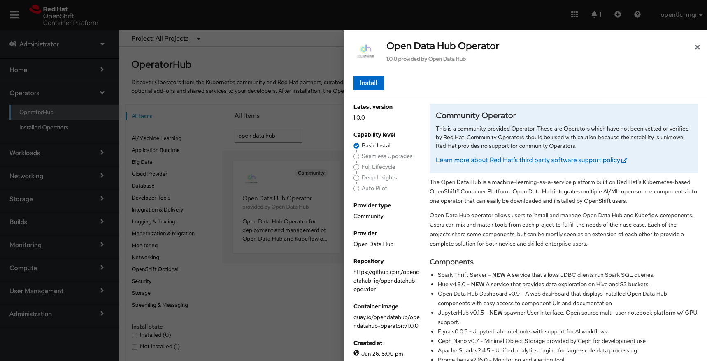
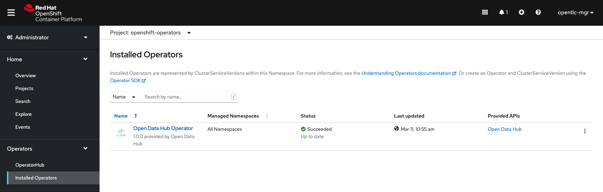
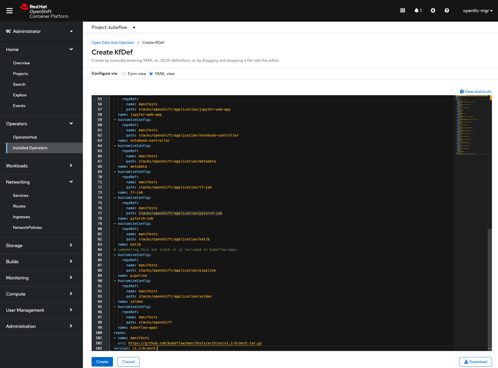
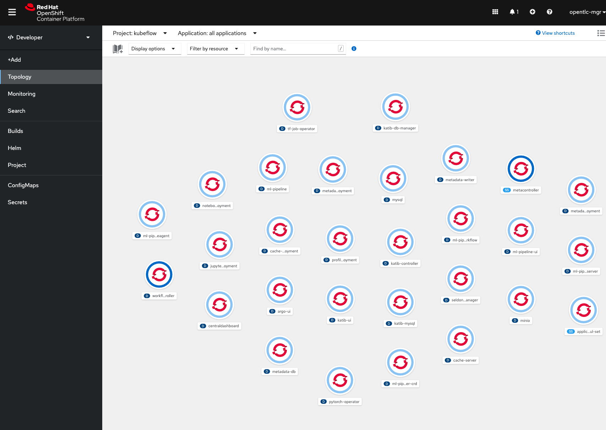
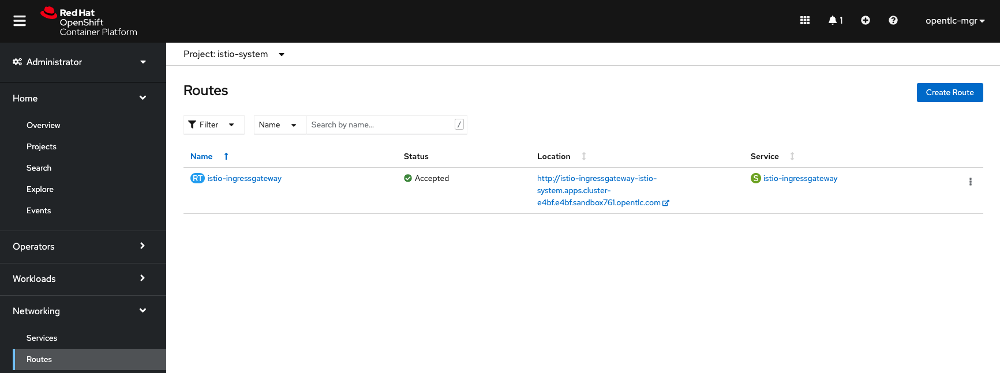
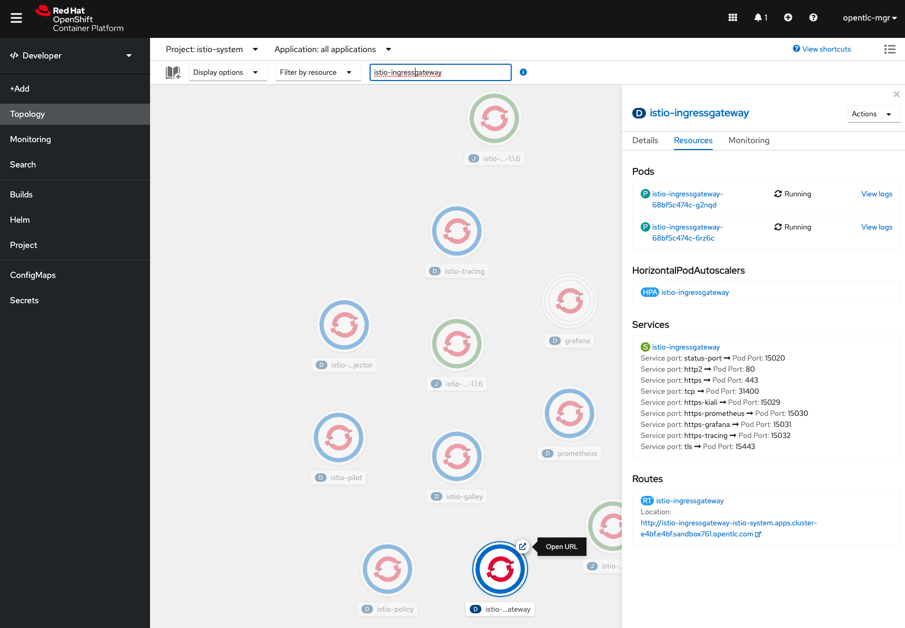
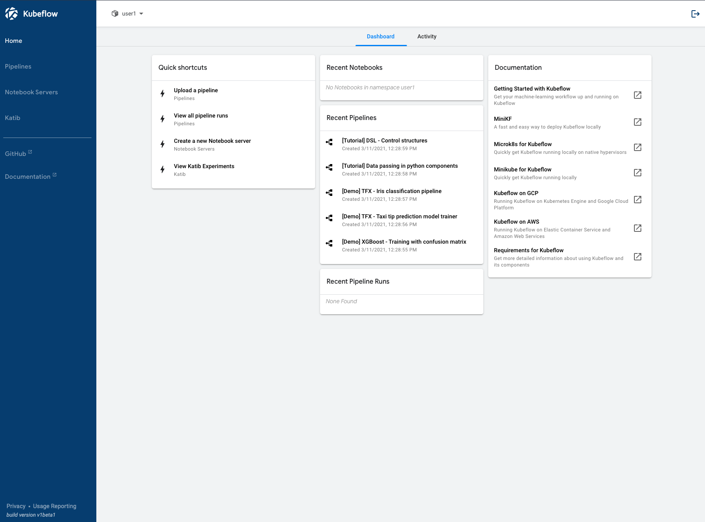

# How to install Kubeflow v1.2 on OpenShift using the Operator

The latest release of Kubeflow incorporates new changes to the configuration files structure, or stacks, that ultimately organize files into distribution-specific manifests for platforms like OpenShift. If you are interested in the details here is the source [Pull Request](https://github.com/kubeflow/manifests/pull/1739). 

The goal of this post is to perform a default install of Kubeflow v1.2 on Red Hat OpenShift v4.7 using the Open Data Hub Operator v1.0 from the OpenShift web console. Screen shots will follow steps.

## Major Steps
1. Log into OpenShift web console with admin user
1. Install the Open Data Hub Operator
1. Create `kubeflow` project
1. Install Kubeflow
1. Monitor the Install
1. Access Kubeflow UI

## Pre-requirements
1. MUST have cluster admin privileges
1. SHOULD NOT have an [existing istio service mesh](https://istio.io/latest/docs/ops/deployment/deployment-models/#multiple-meshes) or name collisions will occur
1. MUST NOT have an existing project named istio-system as kubeflow will install istio service mesh
1. MUST NOT have remaining mutatingwebhooks NOR validatingwebhooks from prior installation or installation will fail
1. MUST NOT deploy kubeflow in a project or namespace other than kubeflow or the deployment will fail

# Install Open Data Hub Operator
Open Data Hub Operator should be installed from the Openshift catalog, which is our central marketplace for installing solutions provided by our community and partners. Open Data Hub Operator is not found on operatorhub.io, these operators run on Kubernetes and not Openshift, you will find the kubeflow operator that Red Hat does not maintain and most likely will not successfully install on OpenShift.

## Steps
From the Administrator perspective:
1. Go to Operators > OperatorHub
1. Search for Open Data Hub community operator
1. Select the Open Data Hub Operator
1. Click `Continue` button
1. Click `Install` button
1. Accept the default strategy
   - Update Channel = `beta`
   - Installation mode = `All namespaces on the cluster(default)`
   - Installed Namespace = `openshift-operators`
   - Approval strategy = `Automatic`
1. Click Install

# Create Kubeflow project
At this time, installing kubeflow MUST be done in a namespace called 'kubeflow. This is an [open issue](https://github.com/kubeflow/kubeflow/issues/5647) at the time of this writing.

## Steps
From the Administrator perspective:
1. Go to Home > Projects 
1. Click `Create Project` button
1. Enter values:
   - Name = `kubeflow` (this must be kubeflow)
   - Display Name = `kubeflow` (this can be anything)
   - Description = `Kubeflow ML toolkit` (this can be anything)
1. Change to the Project = `kubeflow`
1. Go to Operators > Installed Operators
1. Wait for the Operator to display Status = `Succeeded`

# Install Kubeflow

## Steps
From the Administrator perspective:
1. From the Project = `kubeflow`
1. Go to Operators > Installed Operators
1. Select the Open Data Hub Operator > Click Create Instance 
1. Click `Create KfDef` button
1. Select `YAML view` radio button
1. Delete all of the text
1. From [Kubeflow manifests](https://github.com/kubeflow/manifests/tree/master/distributions/kfdef) Select kfctl_openshift.v1.2.0.yaml
1. Click `Raw` button for output like [kfctl_openshift.v1.2.0.yaml](https://raw.githubusercontent.com/kubeflow/manifests/master/distributions/kfdef/kfctl_openshift.v1.2.0.yaml)
1. Copy all the text and paste into the YAML View
1. Click `Create` button

# Monitor Install

## Steps
From the Administrator perspective:
1. Go to Home > Events to monitor the deployment

From the Developer perspective:
1. Go to Developer Perspective > Topology under project kubeflow

# Access Kubeflow UI

## Steps 
From the Administrator perspective:
1. Change to project = `istio-system`
1. Go to Networking > Routes
1. Click the location starting with http://istio-ingressgateway...

From the Developer perspective:
1. Change to project = `istio-system`
1. Use the search box for `istio-ingressgateway`
1. Click route starting with http://istio-ingressgateway...

Once you complete the registration process and create a namespace, you will see a dashboard like the one below.

# What Next
From here you can create a notebook, start pipeline and experiments, etc.

# Uninstall Kubeflow

## Steps
From the Adminstrator perspective:
1. From the Project = `kubeflow`
1. Go to Operators > Installed Operators
1. Select the Open Data Hub Operator > Click `Open Data Hub` Menu item
1. Click the Kebab button (the one with 3 vertical dots) > `Delete KfDef` to begin the delete process for Kubeflow
1. You can delete the `kubeflow` and `istio-system` projects as needed
1. You may have mutatingwehooks that are deleted by the operator as they are not owned by the resource that you can [delete from the CLI](https://www.kubeflow.org/docs/openshift/uninstall-kubeflow/)