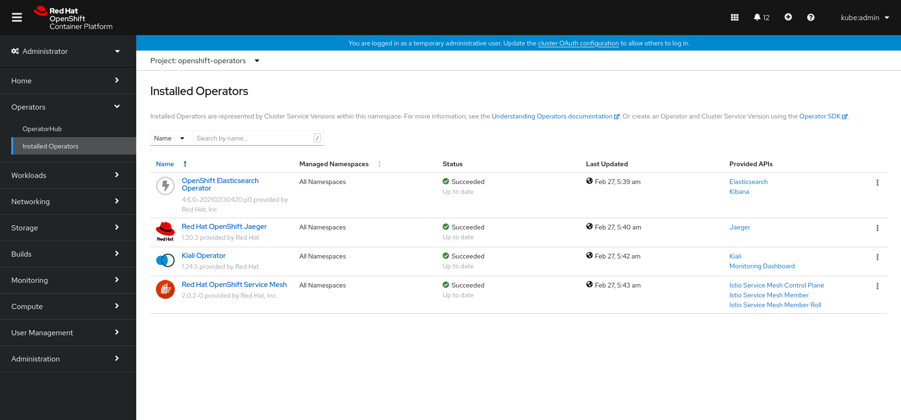
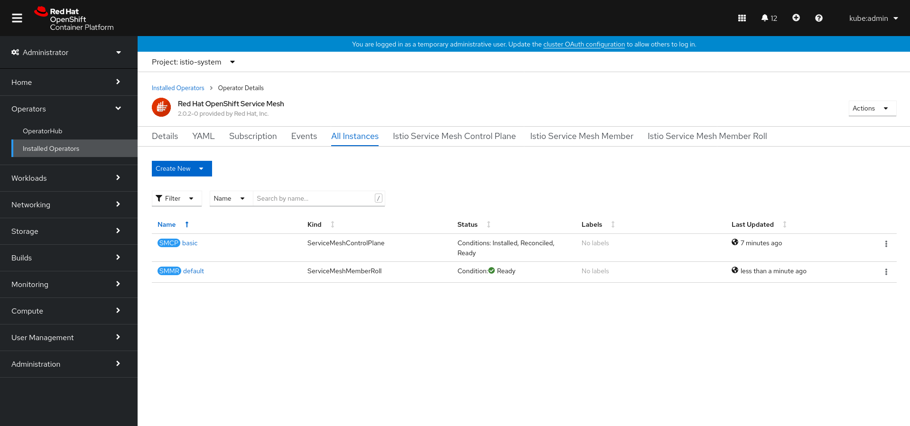
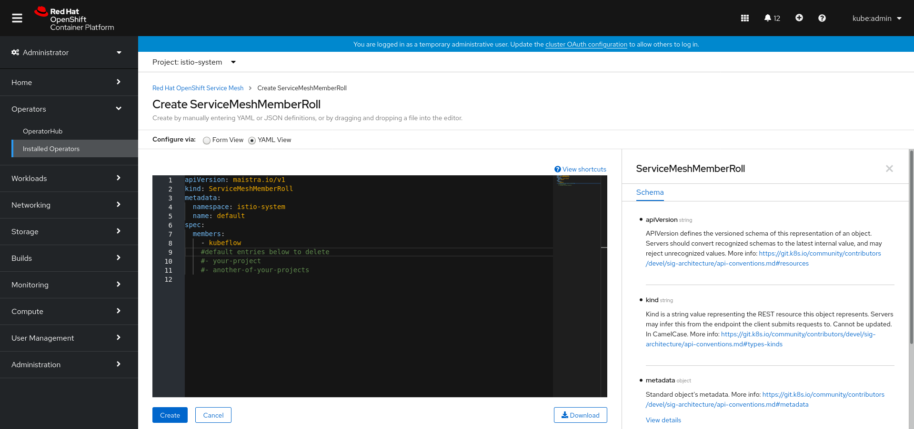
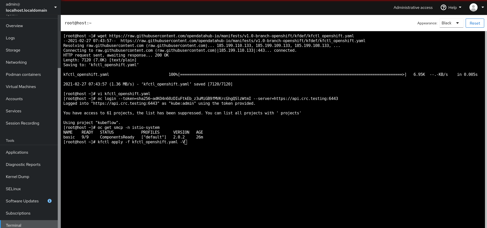
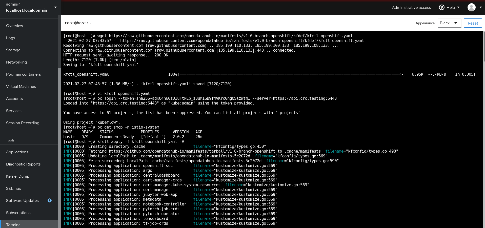
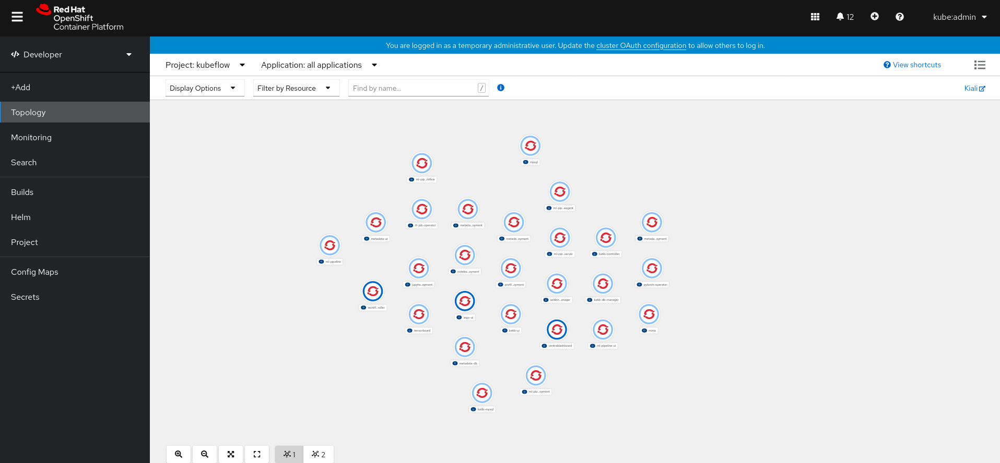
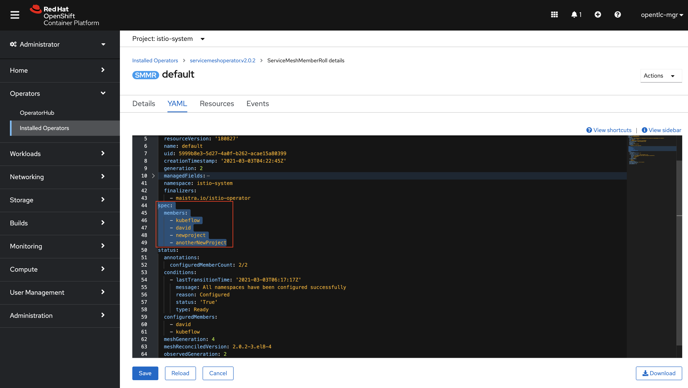
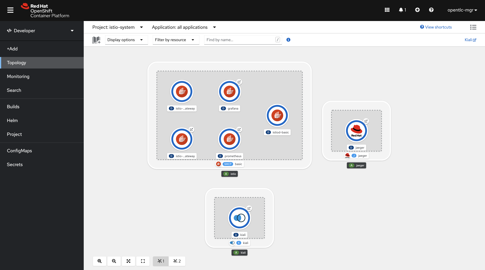
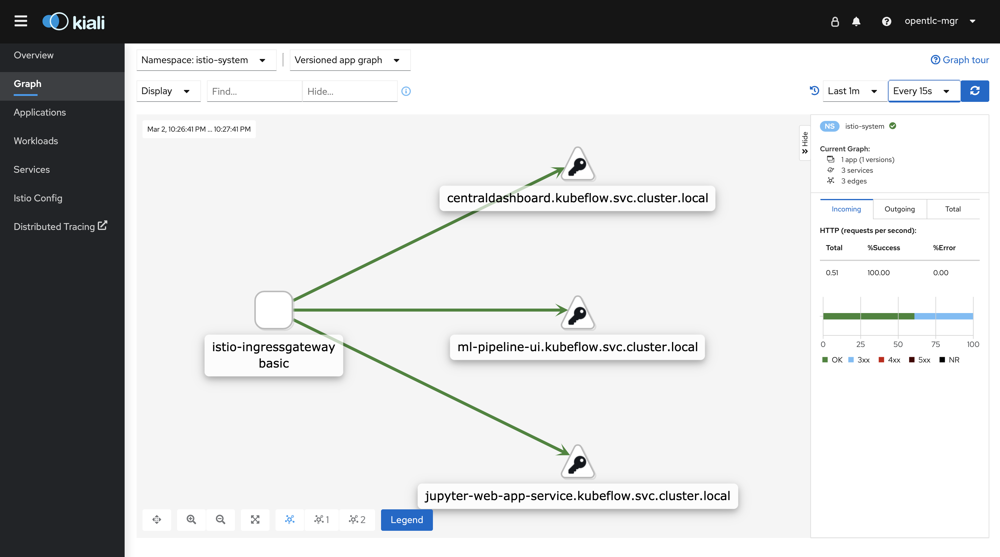

# How to install Kubeflow v1 on OpenShift v4.6 with Service Mesh v2

If you're looking to run a robust machine learning toolkit on an enterprise-class Kubernetes distribution with a microservice network, you came to the right article. This post builds upon the deployment path of earlier software versions [Integrating Kubeflow with Red Hat OpenShift Service Mesh](https://developers.redhat.com/blog/2020/04/24/integrating-kubeflow-with-red-hat-openshift-service-mesh/) with some tweaks along the way for current versions. This process utilizes both the web console and the command line to perform the installation:

## Overview of the procedure
1. Install Operators 
1. Create Projects
1. Configure Service Mesh 
1. Install Kubeflow
1. Customise a configuration 
1. Observe service mesh
1. Uninstall Kubeflow

# Install Operators



As an admin from your OpenShift OperatorHub, you need to install this sequence of 4 Red Hat operators: Elasticsearch, OpenShift Jaeger, Kiali and Red Hat Service Mesh.

First, **install the OpenShift Elasticsearch Operator provided by Red Hat** for configuring and managing an Elasticsearch cluster for use in tracing and cluster logging as well as a Kibana instance to connect to it. 
- Accept defaults for Update Channel
- Installation Mode across all namespaces
- Recommended openshift-operators-redhat namespace
- Automatic Approval Strategy. 

Wait for the Installed Operators status to display Succeeded before continuing.

Second, **install the Red Hat OpenShift Jaeger Operator** for monitoring and troubleshooting microservices-based distributed systems. We are intending to deploy an Elasticsearch cluster via the Jaeger custom resource, so the Elasticsearch Operator must first be installed. 
- Accept defaults for Stable Update Channel - Installation Mode across all namespaces
- Recommended openshift-operators namespace
- Automatic Approval Strategy. 

Wait for the Installed Operators status to display Succeeded before continuing.

Third, install the **Kiali Operator provided by Red Hat** to visualize insights about the mesh components at different levels. 
- Accept defaults for Stable Update Channel 
- Installation Mode across all namespaces
- Recommended openshift-operators namespace
- Automatic Approval Strategy. 

Wait for the Installed Operators status to display Succeeded before continuing.

Last, install the **Red Hat OpenShift Service Mesh Operator**, based on the open source Istio project, adds a transparent layer on existing distributed applications without requiring any changes to the service code. Once an instance of Red Hat OpenShift Service Mesh has been installed, it will only exercise control over services within its own project. 
- Accept defaults for Stable Update Channel
- Installation Mode across all namespaces
- Recommended openshift-operators namespace
- Automatic Approval Strategy. 

Wait for the Installed Operators status to display Succeeded before continuing. 

# Create Projects


Create 2 projects: kubeflow and istio-system.

**Create a new project call kubeflow**, which will serve as the deployment namespace for the kubeflow resources. From the Kubeflow interface, new namespaces will be created and reflected back in OpenShift. This is different than Open Data Hub as the deployment is configured directly in the desired OpenShift project. 

**Create another new project call istio-system**, which will serve as the control-plane for the Kubeflow service mesh and any namespace created from it. 

# Configure Service Mesh 



If you are interested, here is a detailed review in the [differences between upstream Istio Service Mesh and downstream Red Hat Service Mesh](https://access.redhat.com/documentation/en-us/openshift_container_platform/4.6/html-single/service_mesh/index#ossm-vs-community). 

From the istio-system project, you will create a control plane and service mesh member roll that will provide a service mesh for the kubeflow project and other created from it.

Switch to the istio-system project and go to Installed Operators. Select the Istio Service Mesh Control Plane "SMCP" and **Create a Service Mesh Control Plane instance**. If new to this implementation, defaults are recommended. Meanwhile, Here are some configurations to investigate that were set for this deployment:
- Name = `basic`
- Control Plane Version = `v2.0`
- Security > Control Plane Security = `True` to [enable mTLS](https://access.redhat.com/documentation/en-us/openshift_container_platform/4.6/html-single/service_mesh/index#ossm-security-mtls_ossm-security)
- Proxy > Injection > Auto Inject = `True` to ensure [auto inject envoy](https://access.redhat.com/documentation/en-us/openshift_container_platform/4.6/html-single/service_mesh/index#ossm-sidecar-injection_deploying-applications-ossm)

Wait for the SMCP basic status to display Conditions: Installed, Reconciled, Ready. Resource creation can take a few minutes, so monitoring the control plane resources can help identify issues early.



**Create a Istio Service Mesh Member Roll** in the same location from the Red Hat Service Mesh installed operator under the istio-system project. **Switch to the YAML View** and replace the default members with the initial member `kubeflow`. 

For additional projects to become members of this Control Plane, you will have to append the members manually. 

# Install Kubeflow

Switch to a terminal and log into the OCP cluster to deploy the Kubeflow tools. You will need to install 2 tools (oc and kfctl), download and edit a Kubeflow manifest. 

For this part of the procedure, a [RHEL 8.3 host cockpit terminal session](https://access.redhat.com/documentation/en-us/red_hat_enterprise_linux/8/html/managing_systems_using_the_rhel_8_web_console/getting-started-with-the-rhel-8-web-console_system-management-using-the-rhel-8-web-console).

**Download, install and move the oc command line tool into your path.** Detailed steps can be found here: https://docs.openshift.com/container-platform/4.6/cli_reference/openshift_cli/getting-started-cli.html. 

**Log into the cluster using the oc login command.**  

**Download, install and move the kfctl tool into your path.** Detailed steps below.

|step|sample linux command|
|-|-|
|switch to root|`sudo -i`|
|get the kfctl tool|`wget https://github.com/kubeflow/kfctl/releases/download/v1.2.0/kfctl_v1.2.0-0-gbc038f9_linux.tar.gz`|
|unpack the tar|`tar -xf kfctl_v1.2.0-0-gbc038f9_linux.tar.gz`|
|check your path options|`echo $PATH`|
|move the tool into your path|`mv kfctl /usr/bin`|
|check the command|`kfctl version`|
|login as a cluster admin|`oc login --token=<enter-token> --server=https://api.<enter-cluster>.com:6443`|

**Download a copy of a Kubeflow KfDef manifest.** 
If you are unfamiliar with the raw.githubusercontent... url it is from clicking the [raw button on file](https://github.com/redhat-naps-da/ml-toolkit-deployments/blob/main/kubeflow/with-servicemesh/kfctl-openshift.yaml).



|step|sample linux command|
|-|-|
|download the manifest|`wget https://raw.githubusercontent.com/redhat-naps-da/ml-toolkit-deployments/main/kubeflow/with-servicemesh/kfctl-openshift.yaml`|
|review the file|`vim kfctl_openshift_servicemesh.yaml`|

**Apply the Kubeflow manifest.**  This will fetch the configurations from the github repo, create a local .cache manifest and kustomize directory for each of the included application entries from the KfDef. **It will likely error**...but we can fix it.

|step|sample linux command|
|-|-|
|deploy in kubeflow project|`oc project kubeflow`|
|apply the manifest (expect error)|`kfctl apply -f kfctl_openshift_servicemesh.yaml -V`|

***Fixing the error***

You will likely hit this error that is reporting two issues: 
1. `sni_hosts` was replaced with `sniHosts` in istio 1.6 so we need to change it.
1. comment out the ClusterRbacConfig block entirely. 
```
WARN[0009] Encountered error applying application istio:  (kubeflow.error): Code 500 with message: Apply.Run : [error when creating "/tmp/kout121275116": admission webhook "validation.istio.io" denied the request: configuration is invalid: TLS match must have at least one SNI host, unable to recognize "/tmp/kout121275116": no matches for kind "ClusterRbacConfig" in version "rbac.istio.io/v1alpha1"]  filename="kustomize/kustomize.go:284"
```

****Edit the kf-istio-resources.yaml****
|step|sample linux command|
|-|-|
|edit the kf-istio-resources|`vim kustomize/istio/base/kf-istio-resources.yaml`|
|line 63|replace `sni_hosts` with `sniHosts`|
|line 96|replace `sni_hosts` with `sniHosts`|
|lines 104-110|delete|

If you want to make more changes you should clone the entire manifest repo, point the KfDef uri to your now local manifest, and run a kfctl build -f kfctl_openshift.yaml prior to the apply. 



|step|sample linux command|
|-|-|
|deploy in kubeflow project|`oc project kubeflow`|
|apply the manifest|`kfctl apply -f kfctl_openshift_servicemesh.yaml -V`|



The Developer perspective offers a visual topology to visualize the deployment.

Keep the three artifacts (.cache/, kfctl_openshift.yaml, kustomize/) to modify or delete the deployment. Wait for the apply command to complete and log a message `Applied the configuration Successfully!`.

**Get the route to the Kubeflow Central Dashboard.** 1. You can get the url from the CLI 
1. Go to istio-system project > Networking > Routes and click on the ingress-gateway or kubeflow route. 


|step|sample linux command|
|-|-|
|get route to paste in browser|`oc get routes -n istio-system istio-ingressgateway -o jsonpath='http://{.spec.host}/'`|

IMPORTANT: Remember to append and save any new namespaces to the istio-system project ServiceMeshMemberRoll in order for the correct route to be created (e.g. Notebooks).


# Observe service mesh

You can access Kiali and Jaeger to better understand you service mesh and perform data tracing by clicking on the Open URL route arrows on the services.





# Uninstall Kubeflow

No good procedure is ever complete without a way to undo it, make modifications and run it again. Those 3 artifacts from earlier enable the delete command to execute.

|step|sample linux command|
|-|-|
|login as a cluster admin|`oc login --token=<enter-token> --server=https://api.<enter-cluster>.com:6443`|
|delete the deployment|`kfctl delete -f kfctl_openshift_servicemesh.yaml -V`|
|delete mutating webhooks|`oc delete mutatingwebhookconfigurations.admissionregistration.k8s.io --all`|
|delete validating webhooks|`oc delete validatingwebhookconfigurations.admissionregistration.k8s.io --all`|
|remove the generated folders|`rm -rf {kustomize,.cache}`|
